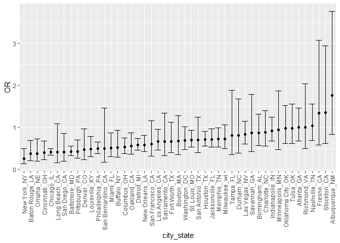
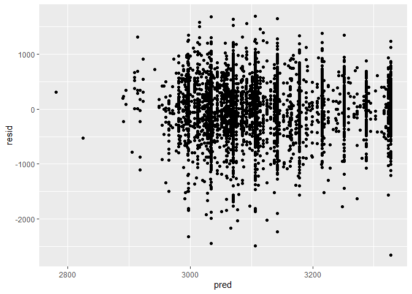

Homework 6
================
Lily Wang
11/24/2020

## Problem 1

``` r
hom_df <- read_csv("./data/homicide-data.csv") %>% 
   mutate(
    victim_age = as.numeric(victim_age),
    city_state = str_c(city, state, sep = "_"),
    resolved = case_when(
      disposition == "Closed without arrest" ~ 0,
      disposition == "Closed by arrest" ~ 1,
      disposition == "Open/No arrest" ~ 0)
    ) %>% 
  select(city_state, victim_age, victim_race, victim_sex, resolved) %>% 
  filter(city_state != "Tulsa_AL",
         victim_race %in% c("White", "Black"))
```

    ## 
    ## -- Column specification --------------------------------------------------------
    ## cols(
    ##   uid = col_character(),
    ##   reported_date = col_double(),
    ##   victim_last = col_character(),
    ##   victim_first = col_character(),
    ##   victim_race = col_character(),
    ##   victim_age = col_character(),
    ##   victim_sex = col_character(),
    ##   city = col_character(),
    ##   state = col_character(),
    ##   lat = col_double(),
    ##   lon = col_double(),
    ##   disposition = col_character()
    ## )

    ## Warning: Problem with `mutate()` input `victim_age`.
    ## i NAs introduced by coercion
    ## i Input `victim_age` is `as.numeric(victim_age)`.

    ## Warning in mask$eval_all_mutate(dots[[i]]): NAs introduced by coercion

Start with one city:

``` r
baltimore_df <- hom_df %>% 
  filter(city_state == "Baltimore_MD")

glm(resolved ~ victim_age + victim_race + victim_sex, data = baltimore_df, family = binomial()) %>% 
  broom::tidy() %>% 
  mutate(
    OR = exp(estimate),
    CI_lower = exp(estimate - 1.96 * std.error),
    CI_upper = exp(estimate + 1.96 * std.error)
  ) %>% 
  select(term, OR, starts_with("CI")) %>% 
  knitr::kable(digits = 3)
```

| term              |    OR | CI\_lower | CI\_upper |
| :---------------- | ----: | --------: | --------: |
| (Intercept)       | 1.363 |     0.975 |     1.907 |
| victim\_age       | 0.993 |     0.987 |     1.000 |
| victim\_raceWhite | 2.320 |     1.648 |     3.268 |
| victim\_sexMale   | 0.426 |     0.325 |     0.558 |

Repeat across all cities:

``` r
model_results_df <- hom_df %>% 
  nest(data = -city_state) %>% 
  mutate(
    models = map(.x = data, ~glm(resolved ~ victim_age + victim_race + victim_sex, data = .x, family = binomial())),
    results = map(models, broom::tidy)
  ) %>% 
  select(city_state, results) %>% 
  unnest(results) %>% 
  mutate(
    OR = exp(estimate),
    CI_lower = exp(estimate - 1.96 * std.error),
    CI_upper = exp(estimate + 1.96 * std.error)
  ) %>% 
  select(city_state, term, OR, starts_with("CI"))
```

Plot OR by sex:

``` r
model_results_df %>% 
  filter(term == "victim_sexMale") %>% 
  mutate(city_state = fct_reorder(city_state, OR)) %>% 
  ggplot(aes(x = city_state, y = OR)) + 
  geom_point() +
  geom_errorbar(aes(ymin = CI_lower, ymax = CI_upper)) +
  theme(axis.text.x = element_text(angle = 90, vjust = 0.5, hjust=1))
```

<!-- -->

It seems that in a majority of the cities, the odds of a male victim
case being resolved is lower than if the victim was female.

## Problem 2

``` r
weight_df <- read_csv("./data/birthweight.csv") %>% 
  mutate(babysex = as.factor(babysex),
         frace = as.factor(frace),
         mrace = as.factor(mrace),
         malform = as.factor(malform))
```

    ## 
    ## -- Column specification --------------------------------------------------------
    ## cols(
    ##   .default = col_double()
    ## )
    ## i Use `spec()` for the full column specifications.

``` r
lm(bwt ~ fincome + smoken + fincome*smoken, data = weight_df)
```

    ## 
    ## Call:
    ## lm(formula = bwt ~ fincome + smoken + fincome * smoken, data = weight_df)
    ## 
    ## Coefficients:
    ##    (Intercept)         fincome          smoken  fincome:smoken  
    ##      2979.2770          3.6272         -1.1193         -0.1022

I assume a baby’s immediate physical attributes and measurements would
be highly correlated with its weight, so instead, I would like to
explore how predictive the mother’s environment during pregnancy is of
birth weight. From prior knowledge, I know that smoking and stress both
have adverse effects on fetuses, and low family income may cause the
mother a lot of stress.

Compare my proposed model with the two others listed:

``` r
cv_df = 
  crossv_mc(weight_df, 100) %>% 
  mutate(
    proposed_mod  = map(train, ~lm(bwt ~ fincome + smoken + fincome*smoken, data = .x)),
    ga_mod  = map(train, ~lm(bwt ~ blength + gaweeks, data = .x)),
    interaction_mod  = map(train, ~lm(bwt ~ bhead + blength + babysex + bhead*blength + bhead*babysex + blength*babysex + bhead*blength*babysex, data = .x))) %>% 
  mutate(
    rmse_proposed = map2_dbl(proposed_mod, test, ~rmse(model = .x, data = .y)),
    rmse_ga = map2_dbl(ga_mod, test, ~rmse(model = .x, data = .y)),
    rmse_interaction = map2_dbl(interaction_mod, test, ~rmse(model = .x, data = .y)))
```

Now to compare the three models by plotting the prediction error
distribution for each:

``` r
cv_df %>% 
  select(starts_with("rmse")) %>% 
  pivot_longer(
    everything(),
    names_to = "model", 
    values_to = "rmse",
    names_prefix = "rmse_") %>% 
  mutate(model = fct_inorder(model)) %>% 
  ggplot(aes(x = model, y = rmse)) + geom_violin()
```

<!-- -->

My proposed model had the worst predictive accuracy.

## Problem 3

``` r
weather_df = 
  rnoaa::meteo_pull_monitors(
    c("USW00094728"),
    var = c("PRCP", "TMIN", "TMAX"), 
    date_min = "2017-01-01",
    date_max = "2017-12-31") %>%
  mutate(
    name = recode(id, USW00094728 = "CentralPark_NY"),
    tmin = tmin / 10,
    tmax = tmax / 10) %>%
  select(name, id, everything())
```

    ## Registered S3 method overwritten by 'hoardr':
    ##   method           from
    ##   print.cache_info httr

    ## using cached file: C:\Users\Lily\AppData\Local\Cache/R/noaa_ghcnd/USW00094728.dly

    ## date created (size, mb): 2020-10-02 11:53:20 (7.535)

    ## file min/max dates: 1869-01-01 / 2020-09-30
